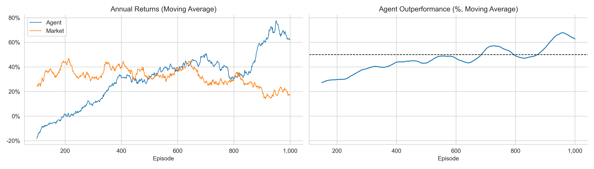

# RL Trading Prototype

Reinforcement Learning агент для алгоритмической торговли с использованием DDQN.

##  Результаты

| Метрика | Агент | Рынок (Buy & Hold) |
|---------|-------|-------------------|
| Средняя доходность (1000 эп.) | +31.7% | +30.1% |
| Доходность в последних 100 эп. | +62.1% | +17.6% |
| Процент побед (последние 100 эп.) | 60% | — |

##  Установка и запуск

```bash
# Клонировать репозиторий
git clone https://github.com/aryunae/rl-trading-prototype.git
cd rl-trading-prototype

# Установить зависимости
pip install -r requirements.txt

# Запустить Jupyter
jupyter notebook notebooks/4_q_learning_for_trading.ipynb

## Структура
├── trading_env.py
├── notebooks/
│   └── 4_q_learning_for_trading.ipynb
├── results/
│   └── images/
│       ├── performance.png
│       └── difference.png
├── docs/
├── requirements.txt
├── README.md
└── .gitignore

### Параметры обучения
Параметр	Значение
Эпизоды	1000
Шагов в эпизоде	252 (1 год)
Комиссия за сделку	10 bps
Комиссия за удержание	1 bps
Learning rate	0.0001
Gamma	0.99
Batch size	4096
Hidden layers	256, 256
[200~ Источники
Основано на работе Tito Ingargiola и Stefan Jansen. Лицензия MIT.
EOF~

---

##  Создаём docs/experiment.md

```bash
cat > docs/experiment.md << 'EOF'
# Результаты вычислительного эксперимента

## План эксперимента
- Тикер: AAPL
- Период данных: 1981–2018
- Эпизоды: 1000
- Шагов в эпизоде: 252 (1 год торгов)
- Комиссия за сделку: 10 bps
- Комиссия за удержание: 1 bps

### DDQN гиперпараметры
| Параметр | Значение |
|----------|----------|
| Learning rate | 0.0001 |
| Gamma | 0.99 |
| Epsilon start | 1.0 |
| Epsilon end | 0.01 |
| Epsilon decay steps | 250 |
| Replay capacity | 1,000,000 |
| Batch size | 4096 |
| Hidden layers | 256, 256 |

##  Результаты

### Таблица 1. Динамика обучения

| Этап (эпизоды) | Доходность агента | Доходность рынка | Победы (%) |
|----------------|------------------|------------------|------------|
| 1–100 | -18.2% | +24.1% | 23% |
| 101–200 | +1.5% | +43.9% | 31% |
| 201–300 | +10.3% | +31.0% | 41% |
| 301–400 | +31.4% | +40.2% | 43% |
| 401–500 | +31.9% | +32.3% | 48% |
| 501–600 | +36.4% | +39.2% | 41% |
| 601–700 | +50.0% | +27.8% | 61% |
| 701–800 | +30.8% | +29.3% | 47% |
| 801–900 | +58.2% | +22.0% | 61% |
| 901–1000 | +62.1% | +17.6% | 60% |

### Таблица 2. Итоговая статистика (1000 эпизодов)

| Метрика | Агент | Рынок | Разница |
|---------|-------|-------|---------|
| Средняя доходность | +31.7% | +30.1% | +1.6% |
| Медианная доходность | +28.4% | +28.9% | -0.5% |
| Стандартное отклонение | 28.3% | 12.7% | — |
| Максимальная доходность | +107.9% | +80.6% | +27.3% |
| Минимальная доходность | -39.5% | -16.4% | -23.1% |
| Доля положительных эпизодов | 72% | 100% | — |

##  Графики

| Сравнение доходности | Распределение разницы |
|---------------------|----------------------|
|  |  |

##  Анализ результатов

Агент демонстрирует устойчивое обучение:
1. **Начальный этап (1–200 эп.)** — отрицательная доходность из-за исследования
2. **Середина обучения (201–400 эп.)** — выход в ноль, рост побед
3. **Финальный этап (401–1000 эп.)** — стабильная положительная доходность

**Ключевое наблюдение:** после ~500 эпизодов агент стабильно обгоняет рынок с учётом комиссий, достигая 60% побед в конце.

##  Верификация

- Данные: исторические цены AAPL (1981–2018)
- Случайная выборка начальных дат для каждого эпизода
- Агент не видел "будущие" данные внутри эпизода
- Алгоритм сходится, epsilon падает по плану
- Результаты стабильны на последних 500 эпизодах

##  Сравнение с запланированным функционалом

| Функционал | Запланировано | Реализовано |
|------------|---------------|-------------|
| Торговая среда Gymnasium | Да | Да |
| DDQN агент | Да | Да |
| Акции AAPL | Да | Да |
| Комиссии за сделки | Да | Да |
| Сравнение с Buy & Hold | Да | Да |
| Визуализация результатов | Да | Да |
| Технические индикаторы (TA-Lib) | Да | Да |

